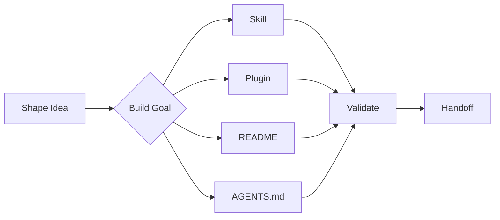

<div align="center">

# 𝓑𝓾𝓲𝓵𝓭 𝓖𝓸𝓪𝓵𝓼

<p align="center">从目标澄清到可验证的能力与文档 · 𝑭𝒓𝒐𝒎 𝑰𝒅𝒆𝒂𝒔 𝒕𝒐 𝑺𝒌𝒊𝒍𝒍𝒔 𝒂𝒏𝒅 𝑫𝒐𝒄𝒔</p>

[](https://code.claude.com/docs/en/plugins)
[](https://developers.openai.com/plugins/)
[](https://z.ai)
[](https://github.com/agentskills/agentskills)
[](https://github.com/koco-co/build-goals/actions/workflows/validate-skills.yml)
[](https://www.python.org/)
[](#license)

</div>

<a id="overview"></a>

<h2 align="center">𝑶𝒗𝒆𝒓𝒗𝒊𝒆𝒘 · 简介</h2>

<p><code>build-goals</code> 聚焦目标澄清、<b>Agent Skill</b> 与 <b>Plugin</b> 构建、项目文档及规范检查，不再提供端到端软件项目开发编排。它既是可以直接加载的 <b>Claude Code</b>、<b>Codex</b> 与 <b>ZCode</b> 多平台 <b>Plugin</b>，也为没有跨 <b>Skill</b> 依赖的能力保留独立安装方式。</p>

- 当前直接适配 <b>Claude Code</b>、<b>Codex</b> 与 <b>ZCode</b>。
- 本仓库不再提供 <b>DeepSeek Harness</b> 专用包；<b>DSH</b> 使用其自身的 <b>Codex</b> 兼容能力，本仓库不单独验证该路径。
- 其他 <b>Coding Agent</b> 尚未声明兼容；新增平台前会先核对真实能力与契约。

<a id="capabilities"></a>

<h2 align="center">𝑪𝒂𝒑𝒂𝒃𝒊𝒍𝒊𝒕𝒊𝒆𝒔 · 已收录能力</h2>

| <b>Skill</b>                                 | 作用                                                                     |
| -------------------------------------------- | ------------------------------------------------------------------------ |
| [`shape-idea`](skills/shape-idea/)           | 澄清目标与取舍，涉及界面时逐状态展示交互和业务状态流                      |
| [`health-check`](skills/health-check/)       | 统一检查项目规范产物，报告问题并在确认后修复、验证和复检                  |
| [`build-skill`](skills/build-skill/)         | 按能力设计 <b>Frontmatter</b>，构建并审查高质量 <b>Agent Skill</b>       |
| [`build-plugin`](skills/build-plugin/)       | 构建、升级或迁移多平台 <b>Plugin</b>                                     |
| [`build-readme`](skills/build-readme/)       | 探索项目并创建或更新 <b>GitHub</b> 风格 <b>README</b>                    |
| [`build-agents-md`](skills/build-agents-md/) | 初始化或整体重构跨平台 <b>AGENTS.md</b> 与 <b>CLAUDE.md</b>              |
| [`handoff`](skills/handoff/)                 | 整理跨会话交接文档并生成可直接复制的接续提示词                           |

<p><code>health-check</code> 统一检查项目中的 <b>Agent Skill</b>、<b>Plugin</b>、<b>README</b>、<code>AGENTS.md</code> / <code>CLAUDE.md</code>。它先只读检查并一次性报告有证据的问题；用户确认后，直接组织对应领域修复、验证并重新检查，不生成持久化健康报告。</p>

<p><code>build-skill</code> 会根据调用方式、参数、权限、上下文与硬性环境要求形成 <b>Frontmatter</b> 字段决策矩阵；实现后分别完成内容审查、文案审查、内容回归和适用的独立 <b>Reviewer</b> 审查。</p>

<p><code>build-readme</code> 会先了解代码、命令、测试、<b>CI</b>、文档和资源并提供具体修改预览；用户确认后才创建或更新 <b>README</b>，并分别报告静态检查、<b>GitHub</b> 渲染和未验证内容。</p>

<p><code>build-agents-md</code> 会根据仓库证据筛选项目特有指令，并按应用、库、<b>CLI</b> 或 <b>Monorepo</b> 的实际结构组织根目录和子目录 <code>AGENTS.md</code>；用户确认完整内容预览后，才创建同目录真实 <code>CLAUDE.md</code>，其内容精确为 <code>@AGENTS.md</code>，供 <b>Claude Code</b> 导入同一正文。</p>

<a id="workflow"></a>

<h2 align="center">𝑾𝒐𝒓𝒌𝒇𝒍𝒐𝒘 · 从想法到交付</h2>



<a id="principles"></a>

<h2 align="center">𝑷𝒓𝒊𝒏𝒄𝒊𝒑𝒍𝒆𝒔 · 核心原则</h2>

- 先查明，再设计：先读取需求、仓库与平台约定，再提出方案。
- 确认后实施：用户确认目录、边界和验收标准前，不修改目标文件。
- 保护当前工作：最新 <b>HEAD</b>、未提交修改和新增文件都视为用户资产，不回滚、不覆盖。
- 单一规范源：跨 <b>Skill</b> 运行依赖由清单声明，并以可校验、可同步的普通镜像兼容两端客户端缓存。
- 确定性优先：已有 <b>CLI</b> → 脚本 → 模板 → <b>Few-shot</b> → 规则 → 提示词。
- 渐进式读取：主 <code>SKILL.md</code> 只保留路由和主流程，复杂内容按需读取。
- 验证可复现：静态检查、内容审查、文案审查与真实平台测试分别记录。
- 平台差异隔离：<b>Claude Code</b>、<b>Codex</b> 与 <b>ZCode</b> 的 <b>Manifest</b>、调用策略和平台扩展分别配置。

<a id="structure"></a>

<h2 align="center">𝑺𝒕𝒓𝒖𝒄𝒕𝒖𝒓𝒆 · 仓库结构</h2>

```text
build-goals/
├── AGENTS.md
├── CLAUDE.md
├── .plugin-shared-files.json
├── .agents/
│   └── plugins/
│       └── marketplace.json
├── .claude-plugin/
│   ├── marketplace.json
│   └── plugin.json
├── .codex-plugin/
│   └── plugin.json
├── .zcode-plugin/
│   └── plugin.json
├── .github/
│   └── workflows/
│       └── validate-skills.yml
├── scripts/
│   └── install_skill.py
├── skills/
│   ├── shape-idea/
│   ├── health-check/
│   ├── build-skill/
│   ├── build-plugin/
│   ├── build-readme/
│   ├── build-agents-md/
│   └── handoff/
└── tests/
```

<p><code>build-plugin</code> 从 <code>build-skill</code> 复用的规则、模板、校验器和 <b>Reviewer Agent</b> 在 <code>.plugin-shared-files.json</code> 中声明规范源。仓库保存内容一致的普通镜像，避免 <b>Codex</b> 运行缓存省略嵌套软链接；<code>skills/build-plugin/scripts/sync_shared_files.py</code> 负责显式同步，严格校验会拒绝缺失、软链接或内容漂移。</p>

<a id="quick-start"></a>

<h2 align="center">𝑸𝒖𝒊𝒄𝒌 𝑺𝒕𝒂𝒓𝒕 · 快速开始</h2>

<a id="claude-code"></a>

<h3 align="center">𝑪𝒍𝒂𝒖𝒅𝒆 𝑪𝒐𝒅𝒆 · 添加仓库 𝑴𝒂𝒓𝒌𝒆𝒕𝒑𝒍𝒂𝒄𝒆</h3>

```bash
claude plugin marketplace add koco-co/build-goals@main
claude plugin marketplace list
claude plugin install build-goals@build-goals --scope user
```

<a id="codex"></a>

<h3 align="center">𝑪𝒐𝒅𝒆𝒙 · 添加仓库 𝑴𝒂𝒓𝒌𝒆𝒕𝒑𝒍𝒂𝒄𝒆</h3>

```bash
codex plugin marketplace add koco-co/build-goals --ref main
codex plugin marketplace list
codex plugin add build-goals@build-goals
```

<a id="zcode"></a>

<h3 align="center">𝒁𝑪𝒐𝒅𝒆 · 添加仓库 𝑴𝒂𝒓𝒌𝒆𝒕𝒑𝒍𝒂𝒄𝒆</h3>

<p>在 <b>ZCode</b> 客户端中打开 <b>Settings → Plugin Management → Discover</b>，通过 <code>+</code> 按钮添加 <b>GitHub</b> 仓库 <code>koco-co/build-goals</code> 并安装 <b>Plugin</b>，或选择本地仓库目录。<b>ZCode</b> 沿用 <code>.claude-plugin/marketplace.json</code> 解析 <b>Marketplace</b>，并优先读取 <code>.zcode-plugin/plugin.json</code> 作为 <b>Plugin Manifest</b>。</p>

<p>安装完整 <b>Plugin</b> 后，可在 <b>Claude Code</b> 中调用 <code>/build-goals:health-check</code>，在 <b>Codex</b> 中调用 <code>$build-goals:health-check</code>，在 <b>ZCode</b> 输入框的 <code>/</code> 菜单 <b>Skills</b> 分组中选择对应能力；符合描述的项目健康检查请求也允许模型直接路由。</p>

<a id="standalone-skills"></a>

<h2 align="center">𝑺𝒕𝒂𝒏𝒅𝒂𝒍𝒐𝒏𝒆 𝑺𝒌𝒊𝒍𝒍𝒔 · 独立安装</h2>

<p><b>Plugin</b> 是推荐分发方式。确实只需要一个没有跨 <b>Skill</b> 依赖的能力时，仍可使用兼容安装器；<code>health-check</code> 只随完整 <b>Plugin</b> 分发，安装器会拒绝独立安装。</p>

<p><b>ZCode</b>：</p>

```bash
python3 scripts/install_skill.py build-skill \
  --platform zcode \
  --scope user
```

<p><b>Codex</b>：</p>

```bash
python3 scripts/install_skill.py build-skill \
  --platform codex \
  --scope user
```

<p><b>Claude Code</b>：</p>

```bash
python3 scripts/install_skill.py build-skill \
  --platform claude \
  --scope user
```

<p>将 <code>build-skill</code> 替换为 <code>build-plugin</code>、<code>build-readme</code>、<code>build-agents-md</code>、<code>shape-idea</code> 或 <code>handoff</code> 即可安装另一个独立 <b>Skill</b>。目标目录已存在时默认拒绝覆盖；明确确认后添加 <code>--force</code>。</p>

<a id="validation"></a>

<h2 align="center">𝑽𝒂𝒍𝒊𝒅𝒂𝒕𝒊𝒐𝒏 · 验证</h2>

<p>验证整个多平台 <b>Plugin</b>（三份 <b>Manifest</b> 及版本一致性）：</p>

```bash
python3 skills/build-plugin/scripts/sync_shared_files.py --root .
python3 skills/build-plugin/scripts/validate_plugin.py \
  . \
  --platform all \
  --strict
```

<p>验证单个 <b>Skill</b>：</p>

```bash
python3 skills/build-skill/scripts/validate_skill.py \
  skills/health-check \
  --profile dual \
  --plugin-root . \
  --strict
```

<p>验证 <code>build-readme</code> 创建或更新的 <b>GitHub README</b>：</p>

```bash
python3 skills/build-readme/scripts/validate_readme.py \
  /path/to/project/README.md \
  --project-root /path/to/project \
  --strict
```

<p>验证 <code>build-agents-md</code> 创建或重构的跨平台项目指令：</p>

```bash
python3 skills/build-agents-md/scripts/validate_agents_md.py \
  /path/to/project \
  --strict
```

<p>运行全部测试：</p>

```bash
python3 -m unittest discover -s tests -p 'test_*.py' -v
```

<p><b>GitHub Actions</b> 会在 <b>Push</b> 和 <b>Pull Request</b> 中执行 <b>Plugin</b> 严格校验与全部单元测试。</p>

<a id="naming"></a>

<h2 align="center">𝑵𝒂𝒎𝒊𝒏𝒈 · 文件命名约定</h2>

| 目录         | 命名格式                |
| ------------ | ----------------------- |
| `workflows/` | `§NN-name.md`           |
| `templates/` | `<name>.template.<ext>` |
| `examples/`  | `<name>.example.<ext>`  |
| `prompts/`   | `<name>.agent.md`       |

<a id="platform-support"></a>

<h2 align="center">𝑷𝒍𝒂𝒕𝒇𝒐𝒓𝒎 𝑺𝒖𝒑𝒑𝒐𝒓𝒕 · 平台支持</h2>

| 平台                     | <b>Manifest</b>                         | 静态校验         | 真实客户端验证                                    |
| ------------------------ | --------------------------------------- | ---------------- | ------------------------------------------------- |
| <b>Claude Code</b>       | `.claude-plugin/plugin.json`            | 已接入 <b>CI</b> | 需在本地 <b>Claude Code</b> 完成                  |
| <b>Codex</b>             | `.codex-plugin/plugin.json`             | 已接入 <b>CI</b> | 需在支持 <b>Plugin</b> 的 <b>Codex</b> 客户端完成 |
| <b>ZCode</b>             | `.zcode-plugin/plugin.json`（优先探测） | 已接入 <b>CI</b> | 需在本地 <b>ZCode</b> 客户端完成                  |
| 其他 <b>Coding Agent</b> | 暂无                                    | 暂无             | 暂无                                              |

<a id="license"></a>

<h2 align="center">𝑳𝒊𝒄𝒆𝒏𝒔𝒆 · 许可证</h2>

<p>当前仓库尚未声明开源许可证。在许可证明确前，保留全部权利。</p>
