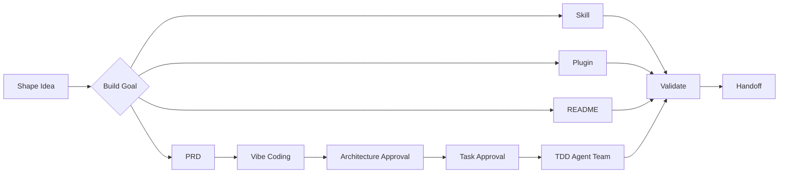

<div align="center">

# 𝓑𝓾𝓲𝓵𝓭 𝓖𝓸𝓪𝓵𝓼

<p align="center"><i>从目标澄清到可验证的软件项目、𝑺𝒌𝒊𝒍𝒍、𝑷𝒍𝒖𝒈𝒊𝒏、𝑷𝑹𝑫 与 𝑹𝑬𝑨𝑫𝑴𝑬 交付 · 𝑭𝒓𝒐𝒎 𝑰𝒅𝒆𝒂𝒔 𝒕𝒐 𝑽𝒆𝒓𝒊𝒇𝒊𝒂𝒃𝒍𝒆 𝑫𝒆𝒍𝒊𝒗𝒆𝒓𝒚</i></p>

[](https://code.claude.com/docs/en/plugins)
[](https://developers.openai.com/plugins/)
[](https://github.com/agentskills/agentskills)
[](https://github.com/koco-co/build-goals/actions/workflows/validate-skills.yml)
[](https://www.python.org/)
[](#license)

</div>

<a id="overview"></a>

<h2 align="center">𝑶𝒗𝒆𝒓𝒗𝒊𝒆𝒘 · 简介</h2>

<p><i><code>build-goals</code> 是一个持续演进与沉淀的 Agent 目标构建仓库。它既是可以直接加载的 Claude Code 与 Codex 双平台 Plugin，也保留单个 Skill 的独立安装方式。</i></p>

- <i>当前适配 Claude Code 与 Codex。</i>
- <i>其他 Coding Agent 尚未声明兼容；新增平台前会先核对真实能力与契约。</i>
- <i>所有 Skill 仅限用户显式调用，普通提示词润色、一般编码和文档任务不会自动进入这些工作流。</i>

<a id="capabilities"></a>

<h2 align="center">𝑪𝒂𝒑𝒂𝒃𝒊𝒍𝒊𝒕𝒊𝒆𝒔 · 已收录能力</h2>

| <i>Skill</i>                           | <i>作用</i>                                                   | <i>Claude Code</i>          | <i>Codex</i>    |
| -------------------------------------- | ------------------------------------------------------------- | --------------------------- | --------------- |
| [`shape-idea`](skills/shape-idea/)     | <i>将初步想法塑造成完整、无歧义的定义</i>                     | `/build-goals:shape-idea`   | `$shape-idea`   |
| [`build-skill`](skills/build-skill/)   | <i>从零构建或系统升级高质量 Agent Skill</i>                   | `/build-goals:build-skill`  | `$build-skill`  |
| [`build-plugin`](skills/build-plugin/) | <i>构建、升级或迁移双平台 Plugin</i>                          | `/build-goals:build-plugin` | `$build-plugin` |
| [`build-prd`](skills/build-prd/)       | <i>调研并生成决策完整的产品 PRD</i>                           | `/build-goals:build-prd`    | `$build-prd`    |
| [`vibe-coding`](skills/vibe-coding/)   | <i>从 PRD 或旧项目编排架构、TDD、多 Agent 开发与全链路验收</i> | `/build-goals:vibe-coding`  | `$vibe-coding`  |
| [`build-readme`](skills/build-readme/) | <i>探索项目并创建或更新 GitHub 风格 README</i>                | `/build-goals:build-readme` | `$build-readme` |
| [`handoff`](skills/handoff/)           | <i>将当前会话整理为供下一位 Agent 接续的文档</i>              | `/build-goals:handoff`      | `$handoff`      |

<p><i><code>build-prd</code> 支持已有项目的全功能梳理，也能把尚不完整的想法完善为详细 PRD。它会调研当前竞品、活跃开源项目与适用的官方规范，逐项确认产品决策，并生成或规范化更新项目唯一的 <code>docs/PRD需求文档.md</code>。</i></p>

<p><i><code>vibe-coding</code> 是端到端软件交付总控：它可以实现 <code>build-prd</code> 的确认产物，也可以审查并迁移已有低质量项目。架构方案和任务列表分别经过用户确认后，才会搭建脚手架、组织 TDD 功能切片、按依赖使用多 Agent 与 Git worktrees、创建原子提交，并完成单元、集成、E2E、条件式视觉/交互、安全和正常测试数据验收。</i></p>

<p><i><code>build-readme</code> 会先探索代码、命令、测试、CI、文档和资源，提交具体写入预览；用户确认后才创建或更新 README，并分别报告机械检查、GitHub 渲染和未验证项。</i></p>

<a id="workflow"></a>

<h2 align="center">𝑾𝒐𝒓𝒌𝒇𝒍𝒐𝒘 · 从想法到交付</h2>



<a id="principles"></a>

<h2 align="center">𝑷𝒓𝒊𝒏𝒄𝒊𝒑𝒍𝒆𝒔 · 核心原则</h2>

- <i>先查明，再设计：先读取需求、仓库与平台约定，再提出方案。</i>
- <i>确认后实施：用户确认目录、边界和验收标准前，不修改目标文件。</i>
- <i>保护当前工作：最新 HEAD、未提交修改和新增文件都视为用户资产，不回滚、不覆盖。</i>
- <i>单一规范源：共享能力使用仓库内相对软链接，不复制多份相同文件。</i>
- <i>确定性优先：已有 CLI → 脚本 → 模板 → Few-shot → 规则 → 提示词。</i>
- <i>渐进式读取：主 <code>SKILL.md</code> 只保留路由和主流程，复杂内容按需读取。</i>
- <i>验证可复现：机械检查、语义验收与真实平台测试分别记录。</i>
- <i>平台差异隔离：Claude Code 与 Codex 的 Manifest、调用策略和平台扩展分别配置。</i>

<a id="structure"></a>

<h2 align="center">𝑺𝒕𝒓𝒖𝒄𝒕𝒖𝒓𝒆 · 仓库结构</h2>

```text
build-goals/
├── .agents/
│   └── plugins/
│       └── marketplace.json
├── .claude-plugin/
│   └── plugin.json
├── .codex-plugin/
│   └── plugin.json
├── .github/
│   └── workflows/
│       └── validate-skills.yml
├── scripts/
│   └── install_skill.py
├── skills/
│   ├── shape-idea/
│   ├── build-skill/
│   ├── build-plugin/
│   ├── build-prd/
│   ├── vibe-coding/
│   ├── build-readme/
│   └── handoff/
└── tests/
```

<p><i><code>build-plugin</code> 中复用的 Skill 模板、质量规则、校验器、检查清单和 Reviewer Agent 均通过相对软链接指向 <code>build-skill</code>。<code>vibe-coding</code> 同样通过相对软链接复用 <code>build-prd</code> 的 PRD 校验器和 <code>build-skill</code> 的独立 Reviewer。所有链接必须解析在当前 Plugin 根目录内；CI 会拒绝绝对链接、失效链接和越界链接。</i></p>

<a id="quick-start"></a>

<h2 align="center">𝑸𝒖𝒊𝒄𝒌 𝑺𝒕𝒂𝒓𝒕 · 快速开始</h2>

<a id="claude-code"></a>

<h3 align="center">𝑪𝒍𝒂𝒖𝒅𝒆 𝑪𝒐𝒅𝒆 · 本地加载整个 𝑷𝒍𝒖𝒈𝒊𝒏</h3>

```bash
git clone https://github.com/koco-co/build-goals.git
cd build-goals
claude --plugin-dir .
```

<p><i>进入 Claude Code 后显式调用：</i></p>

```text
/build-goals:shape-idea
/build-goals:build-skill
/build-goals:build-plugin
/build-goals:build-prd
/build-goals:vibe-coding
/build-goals:build-readme
/build-goals:handoff
```

<p><i>修改 Plugin 后执行：</i></p>

```text
/reload-plugins
```

<p><i>可使用 Claude Code 官方命令补充平台侧检查：</i></p>

```bash
claude plugin validate . --strict
```

<a id="codex"></a>

<h3 align="center">𝑪𝒐𝒅𝒆𝒙 · 添加仓库 𝑴𝒂𝒓𝒌𝒆𝒕𝒑𝒍𝒂𝒄𝒆</h3>

```bash
codex plugin marketplace add koco-co/build-goals --ref main
codex plugin marketplace list
```

<p><i>随后在支持 Plugin 的 Codex / ChatGPT 界面中安装 <code>build-goals</code>，并显式调用：</i></p>

```text
$shape-idea
$build-skill
$build-plugin
$build-prd
$vibe-coding
$build-readme
$handoff
```

<p><i>仓库内的 <code>.agents/plugins/marketplace.json</code> 指向仓库根目录的 Plugin。</i></p>

<a id="standalone-skills"></a>

<h2 align="center">𝑺𝒕𝒂𝒏𝒅𝒂𝒍𝒐𝒏𝒆 𝑺𝒌𝒊𝒍𝒍𝒔 · 独立安装</h2>

<p><i>Plugin 是推荐分发方式。确实只需要一个 Skill 时，仍可使用兼容安装器。</i></p>

<p><i>Codex：</i></p>

```bash
python3 scripts/install_skill.py build-skill \
  --platform codex \
  --scope user
```

<p><i>Claude Code：</i></p>

```bash
python3 scripts/install_skill.py build-skill \
  --platform claude \
  --scope user
```

<p><i>将 <code>build-skill</code> 替换为 <code>build-plugin</code>、<code>build-prd</code>、<code>vibe-coding</code>、<code>build-readme</code>、<code>shape-idea</code> 或 <code>handoff</code> 即可安装另一个 Skill。目标目录已存在时默认拒绝覆盖；明确确认后添加 <code>--force</code>。</i></p>

<a id="validation"></a>

<h2 align="center">𝑽𝒂𝒍𝒊𝒅𝒂𝒕𝒊𝒐𝒏 · 验证</h2>

<p><i>验证整个双平台 Plugin：</i></p>

```bash
python3 skills/build-plugin/scripts/validate_plugin.py \
  . \
  --platform dual \
  --strict
```

<p><i>验证单个 Skill：</i></p>

```bash
python3 skills/build-skill/scripts/validate_skill.py \
  skills/vibe-coding \
  --profile dual \
  --plugin-root . \
  --strict
```

<p><i>验证 <code>build-prd</code> 生成的目标文档：</i></p>

```bash
python3 skills/build-prd/scripts/validate_prd.py \
  /path/to/project/docs/PRD需求文档.md \
  --strict
```

<p><i>验证 <code>vibe-coding</code> 的架构、任务追踪和最终交付：</i></p>

```bash
python3 skills/vibe-coding/scripts/validate_delivery.py \
  /path/to/project \
  --mode greenfield \
  --phase delivery \
  --require-clean \
  --strict
```

<p><i>验证 <code>build-readme</code> 创建或更新的 GitHub README：</i></p>

```bash
python3 skills/build-readme/scripts/validate_readme.py \
  /path/to/project/README.md \
  --project-root /path/to/project \
  --strict
```

<p><i>运行全部测试：</i></p>

```bash
python3 -m unittest discover -s tests -p 'test_*.py' -v
```

<p><i>GitHub Actions 会在 Push 和 Pull Request 中执行 Plugin 严格校验与全部单元测试。</i></p>

<a id="naming"></a>

<h2 align="center">𝑵𝒂𝒎𝒊𝒏𝒈 · 文件命名约定</h2>

| <i>目录</i>  | <i>命名格式</i>         |
| ------------ | ----------------------- |
| `workflows/` | `§NN-name.md`           |
| `templates/` | `<name>.template.<ext>` |
| `examples/`  | `<name>.example.<ext>`  |
| `prompts/`   | `<name>.agent.md`       |

<a id="platform-support"></a>

<h2 align="center">𝑷𝒍𝒂𝒕𝒇𝒐𝒓𝒎 𝑺𝒖𝒑𝒑𝒐𝒓𝒕 · 平台支持</h2>

| <i>平台</i>              | <i>Manifest</i>              | <i>静态校验</i>  | <i>真实客户端验证</i>                      |
| ------------------------ | ---------------------------- | ---------------- | ------------------------------------------ |
| <i>Claude Code</i>       | `.claude-plugin/plugin.json` | <i>已接入 CI</i> | <i>需在本地 Claude Code 完成</i>           |
| <i>Codex</i>             | `.codex-plugin/plugin.json`  | <i>已接入 CI</i> | <i>需在支持 Plugin 的 Codex 客户端完成</i> |
| <i>其他 Coding Agent</i> | <i>暂无</i>                  | <i>暂无</i>      | <i>暂无</i>                                |

<a id="license"></a>

<h2 align="center">𝑳𝒊𝒄𝒆𝒏𝒔𝒆 · 许可证</h2>

<p><i>当前仓库尚未声明开源许可证。在许可证明确前，保留全部权利。</i></p>
