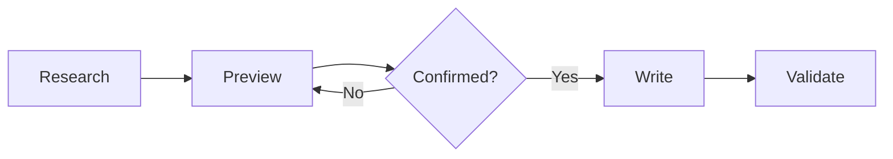

<div align="center">

# 𝓑𝓾𝓲𝓵𝓭 𝓕𝓵𝓸𝔀

<p align="center">从仓库事实到可验证文档 · 𝑭𝒓𝒐𝒎 𝑹𝒆𝒑𝒐𝒔𝒊𝒕𝒐𝒓𝒚 𝑭𝒂𝒄𝒕𝒔 𝒕𝒐 𝑽𝒆𝒓𝒊𝒇𝒊𝒂𝒃𝒍𝒆 𝑫𝒐𝒄𝒖𝒎𝒆𝒏𝒕𝒂𝒕𝒊𝒐𝒏</p>

[](https://www.python.org/)
[](https://docs.github.com/en/get-started/writing-on-github)
[](https://opensource.org/license/mit)

</div>

<!-- 注意：本示例仅用于示范视觉粒度、章节结构与诚实声明写法，不包含真实项目事实。 -->

<a id="overview"></a>

<h2 align="center">𝑶𝒗𝒆𝒓𝒗𝒊𝒆𝒘 · 简介</h2>

<p><b>Build Flow</b> 读取项目入口、命令、测试和现有文档，先生成写入预览，再在用户确认后更新 <b>README</b>。</p>

- 从代码和配置提取已实现能力。
- 使用统一的 <b>GitHub</b> 标题、<b>Shields</b> 和图表风格。
- 分开记录机械检查、渲染检查和未验证项。

<a id="workflow"></a>

<h2 align="center">𝑾𝒐𝒓𝒌𝒇𝒍𝒐𝒘 · 流程</h2>



<a id="quick-start"></a>

<h2 align="center">𝑸𝒖𝒊𝒄𝒌 𝑺𝒕𝒂𝒓𝒕 · 快速开始</h2>

<p>先生成只读预览：</p>

```text
Analyze this repository and preview the README you would write.
```

<p>确认后运行项目的 <b>README</b> 校验器：</p>

```bash
python3 path/to/validate_readme.py README.md --strict
```

<details>
<summary>平台差异或故障排查（次要长内容放在折叠块，不隐藏首次成功步骤）</summary>

- 仅当本机缺少某依赖时才需阅读以下补充说明。
- 保持折叠内容与正文事实一致，不重复完整命令。

</details>

<a id="assets"></a>

<h2 align="center">𝑨𝒔𝒔𝒆𝒕𝒔 · 图片与资源</h2>

<p>图片使用仓库内相对路径并附具体替代文本；<b>SVG</b> 存入仓库、保持有效 <b>XML</b> 且不含脚本、事件处理器或远程资源。</p>

<p>替代文本应描述图片表达的信息，例如“任务流程图：从研究、预览、编写到验证”而非“图片”这类无信息文本；每张图片都要核对浅色、深色背景下的可读性。</p>

<a id="evidence"></a>

<h2 align="center">𝑬𝒗𝒊𝒅𝒆𝒏𝒄𝒆 · 证据</h2>

| 状态         | 含义                          | 交付要求              |
| ------------- | ----------------------------- | --------------------- |
| 已验证       | 有命令、文件或实际结果        | 列出可复现证据         |
| 未验证       | 当前环境未运行                | 不得写成已通过         |
| 阻塞         | 缺少权限或外部条件            | 说明需要什么           |

<a id="license"></a>

<h2 align="center">𝑳𝒊𝒄𝒆𝒏𝒔𝒆 · 限制与许可证</h2>

<p>本仓库尚未声明许可证，实施前请自行确认授权范围；示例中的兼容性、性能与测试结论均应在仓库内找到对应证据后再引用，不得虚构。</p>
