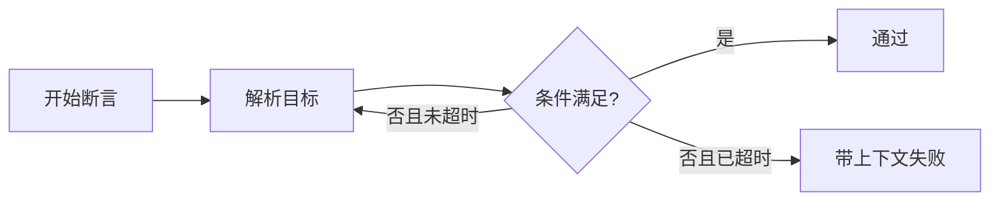

# 原理解释样例：为什么 Web-first 断言不是固定等待

> [!abstract] 核心结论
> Web-first 断言重复观察目标条件，并在明确超时边界内结束；固定等待只推迟一次检查。

## 核心问题

同样是“等页面准备好”，为什么断言重试通常比先睡两秒再检查更可靠？

## 心智模型

把页面看成持续变化的状态机。固定等待是在某个猜测时刻拍一张照片；Web-first 断言是在允许时间内持续询问“目标状态到了吗”。

## 工作机制

重试对象是目标条件，而不是任意暂停。成功意味着在边界内观察到了条件；失败意味着边界内始终没有证据。

## 因果链与关键边界

- 页面完成得早：断言可以提前结束，固定等待仍浪费全部时间。
- 页面完成得晚但仍在超时内：断言继续观察，单次检查可能过早失败。
- 目标永远不会出现：两者最终都失败，但断言能把失败与目标条件关联。
- 错误 Locator：自动重试不能修复目标定义错误，只会持续观察错误对象。

## 错误心智模型

“自动等待会让任何测试稳定”是错误的。它只能处理可观察状态的时序，不会修复错误业务断言、非唯一目标、数据竞争或环境污染。

## 与相邻概念的区别

Locator 解决“观察谁”，Web-first 断言解决“何时认为条件成立”。二者相关但应由不同单元完整讲授。

## 新场景分析

如果测试在点击后只等待两秒，却没有断言业务结果，那么把两秒改成五秒不会增加业务证据。应先定义需要观察的最终状态，再选择对应断言。

## 来源与版本

运行时必须重新核验当前官方断言与超时文档；本文件只示范原理解释结构。
