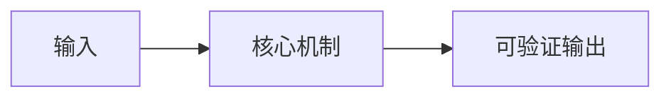

# {{TOPIC_DISPLAY}}概述

> [!abstract] 核心结论
> {{一句话定义主题及其价值。}}

## 基础信息卡

## What：它是什么

## Why：为什么需要它

## Who：适合谁

## When：何时使用

## Where：用在哪里

## How：如何运作

## 类比及边界

> [!example] 直观类比
> {{给出类比，并明确不能类推的部分。}}

## 与替代方案比较

## 学习路线与阶段成果

## 关键流程图

## 常见误区与踩坑

## 重点与面试追问

## 扫盲检查

## 拓展方向与权威链接

## 关联笔记

## 来源与核验
