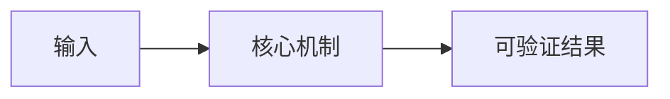

# {{TOPIC_DISPLAY}}概述

> [!abstract] 核心结论
> {{OVERVIEW_CONCLUSION}}

## 核心问题

## What：它是什么

## Why：为什么需要它

## Who：适合谁

## When：何时使用

## Where：用在哪里

## How：如何运作

## 心智模型

## 工作机制

## 适用边界与主要替代方案

## 错误心智模型

## 新场景分析

## 关联笔记

- 学习路线：[[§01-学习路线图]]
- 学习证据：[[{{OVERVIEW_EVIDENCE_PATH}}]]

## 来源与版本
