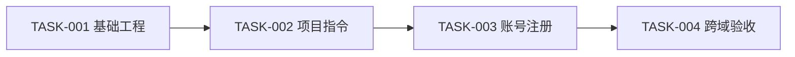

# 实施任务清单示例

本示例展示 `docs/实施任务/实施任务清单.md` 的完整填充结果，重点示范“基础工程就绪”与“项目指令就绪”两个项目就绪分支。任务正文位于 `docs/实施任务/功能域/<功能域>.md`。项目名、提交 SHA 和验证结果均为示例，实际使用时必须替换为当前项目的真实证据。

- 文档状态：已确认
- 更新时间：2026-08-14
- 项目路线：新项目，只按需求实现
- 架构文档：`docs/架构设计/架构设计方案.md`
- 需求快照：`docs/产品需求/需求包清单.yaml`

## 执行原则

- 只实现已确认需求包中的账号注册能力，不增加管理后台或社交登录。
- 行为代码遵循红-绿-重构（Red-Green-Refactor），文档和配置先定义可复核的验证证据。
- 每个任务只修改分配路径；保护用户已有改动。push、发布、部署和受保护分支合并需要单独授权。

## 配套 Skill 计划

| Skill | 触发证据 | 调用阶段 | 阻断 | 恢复条件 | 交付记录 |
| --- | --- | --- | --- | --- | --- |
| `build-agents-md` | 新项目尚无根 `AGENTS.md` | 脚手架验证后、功能开发前 | 是 | 完整内容确认、写入并通过严格校验 | 治理提交 `a1b2c3d` |
| `build-prd` | 需求包已确认 | 不适用 | 否 | — | 有效沿用 |

## 需求追踪

| 功能域 | F/AC/AUD | 功能域任务文件 | 验证层 |
| --- | --- | --- | --- |
| 账号 | F-001、F-001-AC-01、F-001-AC-02 | `功能域/账号.md` | unit/integration/e2e |

## 依赖图

TASK-001 与 TASK-002 串行；本示例只有一个功能域，不创建无收益的并行组。

## Agent 与 Worktree 计划

- Feature Developer：在 `feat/TASK-003-account` worktree 内完成账号注册，只修改 `src/account/` 与 `tests/account/`。
- Integration Manager：在集成分支核对提交边界、运行受影响测试、更新任务 SHA，并在集成通过后清理任务 worktree 与本地分支。
- 当前平台不支持并发时，同一任务按相同文件边界串行执行。

## 任务列表

| 功能域 | 任务文件 | 任务 | 状态 |
| --- | --- | --- | --- |
| 账号 | `功能域/账号.md` | TASK-003 账号注册、TASK-004 跨域验收 | 已确认 |

## 测试数据计划

- `tests/factories/account.py` 创建未注册邮箱、普通成员和受限成员。
- 每个测试使用隔离数据库事务，结束后回滚；不读取生产数据。
- API 与 UI 验证使用同一账号记录，日志和截图使用 `example.test` 域名。

## 基础工程就绪

- 状态：已验证
- 安装命令：`uv sync`
- 安装结果：exit 0，依赖安装成功。
- 启动或 Smoke 命令：`uv run python -m app --help`
- 启动或 Smoke 结果：exit 0，CLI 帮助正常输出。
- 基础测试命令：`uv run pytest`
- 基础测试结果：exit 0，12 passed。
- 基础工程提交：`7f9c1e2`
- 既有 Worktrees：N/A（无既有 worktree）

## 项目指令就绪

「已更新并验证」分支：根 `AGENTS.md` 缺失，已调用 `build-agents-md` 生成并确认完整正文与文件操作。

- 状态：已更新并验证
- 触发证据：新项目没有根 `AGENTS.md` 与同目录 `CLAUDE.md` 单一来源入口。
- 内容确认：已确认 `AGENTS.md` 完整正文、`CLAUDE.md` 相对符号链接及全部文件操作。
- 验证命令：`python3 <build-agents-md>/scripts/validate_agents_md.py . --strict`
- 验证结果：通过。
- 治理提交：`a1b2c3d`
- 功能开发基线：`e5f6a7b`（readiness 执行时的当前 HEAD，已回填明确 SHA）
- 恢复条件：N/A（已就绪）

---

「有效沿用」分支（既有项目，无需更新但仍须验证）：

- 状态：有效沿用
- 触发证据：根 `AGENTS.md` 与 `CLAUDE.md` 单一来源入口已存在且与真实命令一致。
- 内容确认：N/A（无需改写）
- 验证命令：`python3 <build-agents-md>/scripts/validate_agents_md.py . --strict`
- 验证结果：通过。
- 治理提交：N/A（无需更新）
- 功能开发基线：`e5f6a7b`
- 恢复条件：N/A（已就绪）

## 集成顺序

1. 集成 TASK-003，运行账号单元、集成与注册 E2E。
2. 集成 TASK-004，运行跨域用户旅程和完整回归。
3. 每步确认任务提交已在集成分支、worktree 干净且无独有改动后，再清理对应 worktree 与本地分支。

## 验收矩阵

| 层级 | 范围 | 证据 |
| --- | --- | --- |
| 功能域 | F-001、F-001-AC-01、F-001-AC-02 与四类行为样例 | unit/integration/e2e |
| 跨域 | 注册后进入已登录首页 | E2E 与会话状态断言 |
| UI | 注册表单、错误、成功、键盘与响应式 | 浏览器交互和截图 |
| 安全 | 密码不入日志、重复邮箱不泄露账号状态 | 安全测试与日志检查 |

## 提交与回滚

- `7f9c1e2`：基础工程，可单独回滚。
- `a1b2c3d`：项目指令治理，只包含 `AGENTS.md` 与 `CLAUDE.md`。
- TASK-003 与 TASK-004 各形成一个含实现和必要测试的原子提交。
- 回滚使用可审计的反向提交；不重写共享历史。受保护主分支合并与 push 等待用户授权。
