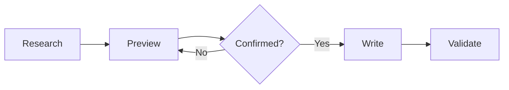

<div align="center">

# 𝓑𝓾𝓲𝓵𝓭 𝓕𝓵𝓸𝔀

<p align="center">从仓库事实到可验证文档 · 𝑭𝒓𝒐𝒎 𝑹𝒆𝒑𝒐𝒔𝒊𝒕𝒐𝒓𝒚 𝑭𝒂𝒄𝒕𝒔 𝒕𝒐 𝑽𝒆𝒓𝒊𝒇𝒊𝒂𝒃𝒍𝒆 𝑫𝒐𝒄𝒖𝒎𝒆𝒏𝒕𝒂𝒕𝒊𝒐𝒏</p>

[](https://www.python.org/)
[](https://docs.github.com/en/get-started/writing-on-github)
[](https://opensource.org/license/mit)

</div>

<a id="overview"></a>

<h2 align="center">𝑶𝒗𝒆𝒓𝒗𝒊𝒆𝒘 · 简介</h2>

<p>_Build Flow_ 读取项目入口、命令、测试和现有文档，先生成写入预览，再在用户确认后更新 _README_。</p>

- 从代码和配置提取已实现能力。
- 使用统一的 _GitHub_ 标题、_Shields_ 和图表风格。
- 分开记录机械检查、渲染检查和未验证项。

<a id="workflow"></a>

<h2 align="center">𝑾𝒐𝒓𝒌𝒇𝒍𝒐𝒘 · 流程</h2>



<a id="quick-start"></a>

<h2 align="center">𝑸𝒖𝒊𝒄𝒌 𝑺𝒕𝒂𝒓𝒕 · 快速开始</h2>

<p>先生成只读预览：</p>

```text
Analyze this repository and preview the README you would write.
```

<p>确认后运行项目的 _README_ 校验器：</p>

```bash
python3 path/to/validate_readme.py README.md --strict
```

<a id="evidence"></a>

<h2 align="center">𝑬𝒗𝒊𝒅𝒆𝒏𝒄𝒆 · 证据</h2>

| 状态         | 含义                          | 交付要求              |
| ------------- | ----------------------------- | --------------------- |
| 已验证       | 有命令、文件或实际结果        | 列出可复现证据         |
| 未验证       | 当前环境未运行                | 不得写成已通过         |
| 阻塞         | 缺少权限或外部条件            | 说明需要什么           |
