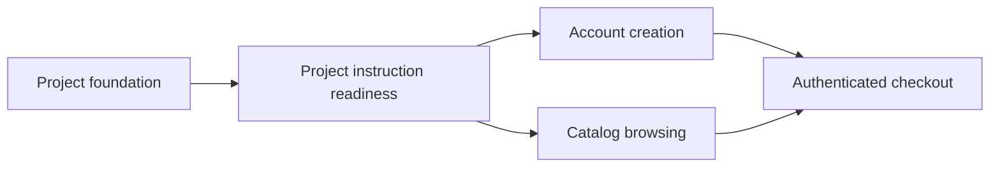

# PRD 驱动项目任务示例

本示例只展示任务粒度，不提供可直接复制的项目事实。

## 依赖图

## 功能切片示例

### TASK-003 账号创建与首次登录

- 需求/验收：F-002、F-002-AC-01、F-002-AC-02
- 目标：用户提交有效资料后得到账号并进入已登录首页；重复邮箱得到最终产品文案。
- 依赖：TASK-002；该任务已确认项目指令有效并通过 readiness。
- 允许修改：`src/account/`、`tests/account/`
- 第一条失败测试：有效用户注册后会话状态为 authenticated。
- 正常测试数据：factory 创建未注册邮箱、普通用户和受限用户。
- 验证：单元、数据库集成、注册 E2E、关键视口交互。
- Worktree：`feat/TASK-003-account-onboarding`
- 提交边界：注册领域、持久化适配、UI 与本功能测试一次提交。
- 回滚：revert commit；无共享数据迁移时无需额外回滚。

这个粒度同时交付用户可见行为和必要基础设施，不把页面壳、数据库表和 API 分成互相不可验收的孤立任务。
