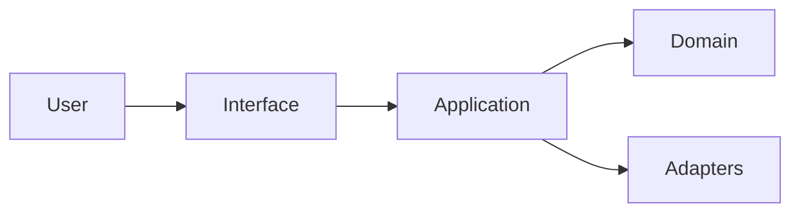

# 架构设计方案

- 文档状态：已确认
- 更新时间：{{YYYY-MM-DD}}
- 基线 HEAD：{{commit-sha 或非 Git 说明}}
- 权威输入：`docs/PRD需求文档.md`
- 适用范围：{{项目与本次实现范围}}

## 需求与约束

### 需求追踪摘要

| 功能 ID   | 验收 ID         | 架构能力       | 验证层                      |
| --------- | --------------- | -------------- | --------------------------- |
| {{F-001}} | {{F-001-AC-01}} | {{组件或能力}} | {{unit/integration/e2e/ui}} |

### 不可变约束

{{运行环境、兼容性、团队、部署、数据和明确排除项。}}

## 调研与方案比较

### 一手来源

| 类型 | 名称     | 来源    | 访问日期       | 支持的决策 |
| ---- | -------- | ------- | -------------- | ---------- |
| 官方 | {{名称}} | {{URL}} | {{YYYY-MM-DD}} | {{事实}}   |

### 候选方案

{{至少两个方案的系统形态、技术栈、优势、成本和风险。}}

### 决策矩阵

| 维度     |     权重 |   方案 A |   方案 B | 依据     |
| -------- | -------: | -------: | -------: | -------- |
| 可维护性 | {{权重}} | {{分数}} | {{分数}} | {{依据}} |

### 最终选择

{{推荐方案、拒绝方案及原因。}}

## 目标架构



{{系统边界、运行时、部署拓扑、数据流和依赖方向。}}

## 技术选型

| 领域     | 选择     | 版本策略 | 原因     | 替代方案 | 验证命令      |
| -------- | -------- | -------- | -------- | -------- | ------------- |
| {{领域}} | {{工具}} | {{策略}} | {{原因}} | {{替代}} | `{{command}}` |

## 目录与模块边界

```text
{{project}}/
├── {{source}}
├── {{tests}}
└── {{docs}}
```

| 路径或模块 | 职责     | 允许依赖 | 禁止依赖 | 所有者   |
| ---------- | -------- | -------- | -------- | -------- |
| {{path}}   | {{职责}} | {{依赖}} | {{边界}} | {{角色}} |

## 接口与数据契约

### 输入与输出

{{API、CLI、UI、事件、错误、状态、日期、枚举与分页等统一契约。}}

### 数据与持久化

{{实体、关系、迁移、事务、并发、备份和恢复。}}

### 外部服务

{{适配层、超时、重试、幂等、降级和测试替身。}}

## 测试与质量策略

- TDD 流程：
- 单元测试：
- 组件测试：
- 集成与契约测试：
- E2E：
- UI/视觉/无障碍：
- 正常测试数据：
- 格式、Lint、类型、构建和 CI：
- 可观测性与性能：

## 安全与配置

- 身份与权限：
- 数据与隐私：
- 环境变量：
- 秘密管理：
- 日志与错误：
- 依赖与供应链：
- 部署权限：

## 交付与运行

{{开发命令、启动方式、环境、CI、部署边界和本次不包含的外部动作。}}

## 风险与权衡

| 风险     | 可能性   | 影响     | 缓解     | 停止或回退条件 |
| -------- | -------- | -------- | -------- | -------------- |
| {{风险}} | {{等级}} | {{影响}} | {{措施}} | {{条件}}       |

## 验收标准

- 架构覆盖全部 PRD 功能和验收 ID。
- 目录、工具链、契约、测试、安全和运行方式均可执行验证。
- 不存在未确认决策、TODO、TBD 或模板占位。
- 后续任务不得无批准偏离本方案。
