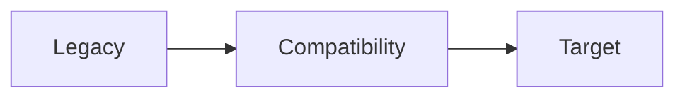

# 架构迁移方案

- 文档状态：已确认
- 更新时间：{{YYYY-MM-DD}}
- 基线 HEAD：{{commit-sha}}
- 迁移范围：{{目录、服务或产品}}
- 产品行为策略：{{保持、允许调整与明确排除}}

## 当前架构基线

### 当前目录与运行方式

```text
{{current-tree}}
```

### 保留优势

{{值得保留的模块、测试、接口和用户工作。}}

## 审查发现

| Finding | 严重度   | 证据       | 影响     | 处理决策           |
| ------- | -------- | ---------- | -------- | ------------------ |
| AUD-001 | {{等级}} | `{{path}}` | {{影响}} | {{修复/保留/暂缓}} |

## 外部参考与方案比较

| 类型 | 名称     | 一手来源 | 访问日期       | 借鉴或拒绝原因 |
| ---- | -------- | -------- | -------------- | -------------- |
| 官方 | {{名称}} | {{URL}}  | {{YYYY-MM-DD}} | {{原因}}       |

{{至少比较渐进迁移和其他可行方案。}}

## 目标架构



```text
{{target-tree}}
```

{{目标模块、依赖、工具链、数据、接口、测试和运行形态。}}

## 迁移差距

| 领域     | 当前状态 | 目标状态 | 迁移单元 | 验证           |
| -------- | -------- | -------- | -------- | -------------- |
| {{领域}} | {{当前}} | {{目标}} | {{单元}} | {{命令或场景}} |

## 分阶段迁移

### Phase 1: {{名称}}

- 目标：
- 任务边界：
- 兼容方式：
- 测试：
- 提交边界：
- 完成条件：

{{继续列出所有阶段。}}

## 兼容与回滚

- 稳定接口：
- 兼容层：
- 数据迁移：
- 数据回滚：
- 代码回滚：
- 双写或灰度：
- 停止条件：

## 仓库治理

- 目录和命名：
- 包管理和锁文件：
- 格式、Lint、类型、测试、pre-commit、CI：
- Prompt、Skill、Agent、Hook、MCP：
- AGENTS.md / CLAUDE.md：
- README 与 docs：
- ignore 与生成物：
- 环境变量与秘密：

## 测试与质量策略

- 当前基线测试：
- Characterization tests：
- 单元、集成、契约和 E2E：
- 正常测试数据：
- UI、视觉、交互与无障碍：
- 性能、可观测性和恢复：
- 每阶段门禁：

## 安全与配置

{{权限、隐私、秘密、依赖、日志、部署和供应链。}}

## 风险与验收

| 风险     | 影响     | 缓解     | 回退条件 | 验收证据 |
| -------- | -------- | -------- | -------- | -------- |
| {{风险}} | {{影响}} | {{措施}} | {{条件}} | {{证据}} |

- 所有 Blocking/High Finding 已映射到迁移任务。
- 用户现有修改和稳定接口不会被无证据覆盖。
- 每阶段可独立验证、提交和回退。
- 不存在未确认决策、TODO、TBD 或模板占位。
