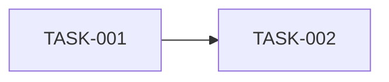

# 实施任务清单

- 文档状态：已确认
- 更新时间：{{YYYY-MM-DD}}
- 架构文档：`docs/{{架构设计方案.md|架构迁移方案.md}}`
- 基线 HEAD：{{commit-sha}}
- 执行状态：进行中

## 执行原则

- 按用户可见功能或可独立验证的迁移单元切片。
- Red-Green-Refactor。
- 无依赖且文件所有权不重叠的任务才使用 worktree 并行。
- 每个任务形成一次可独立回滚的本地 commit。
- 每个任务集成并验证后立即安全清理对应 worktree 和本地任务分支。
- 不 push、不发布、不部署，除非另行授权。
- 合并集成分支到受保护主分支需要最终单独授权。

## 配套 Skill 计划

| Skill | 触发证据 | 调用阶段 | 是否阻断 | 恢复条件 | 交付记录 |
| --- | --- | --- | --- | --- | --- |
| `shape-idea` | {{证据或不适用}} | {{阶段}} | {{是/否}} | {{条件}} | {{产物或 N/A}} |
| `build-prd` | {{证据或不适用}} | {{阶段}} | {{是/否}} | {{条件}} | {{产物或 N/A}} |
| `build-agents-md` | {{证据或预计有效沿用}} | 脚手架验证后、功能开发前 | {{是/否}} | {{条件}} | {{状态、确认、验证、提交}} |
| `build-skill` | {{证据或不适用}} | {{阶段}} | {{是/否}} | {{条件}} | {{产物或 N/A}} |
| `build-plugin` | {{证据或不适用}} | {{阶段}} | {{是/否}} | {{条件}} | {{产物或 N/A}} |
| `build-readme` | {{证据或不适用}} | 最终事实稳定后 | {{是/否}} | {{条件}} | {{产物或 N/A}} |
| `handoff` | {{触发时记录}} | 任意阶段 | 暂停会话 | {{接续条件}} | {{交接路径或 N/A}} |

## 需求追踪

| 需求/验收/Finding          | 任务     | 测试     | 最终状态 | 证据              |
| -------------------------- | -------- | -------- | -------- | ----------------- |
| {{F-001-AC-01 或 AUD-001}} | TASK-001 | {{test}} | 待开始   | {{commit/report}} |

## 依赖图

## Agent 与 Worktree 计划

| 任务     | Agent    | 分支         | Worktree          | 文件所有权  | 并行组 |
| -------- | -------- | ------------ | ----------------- | ----------- | ------ |
| TASK-001 | {{角色}} | `{{branch}}` | `{{path 或 N/A}}` | `{{paths}}` | {{P0}} |

## 任务列表

### TASK-001 {{功能切片}}

- 状态：待开始
- 需求/验收/Finding：{{IDs}}
- 目标：{{唯一可验证结果}}
- 输入：{{输入}}
- 输出：{{输出}}
- 依赖：{{TASK 或无}}
- 允许修改：`{{paths}}`
- 只读依赖：`{{paths}}`
- 禁止修改：`{{paths}}`
- 第一条失败测试：{{test}}
- 正常测试数据：{{fixture/seed}}
- 验证命令：`{{commands}}`
- UI/交互验证：{{适用步骤或 N/A}}
- Agent：{{role}}
- Worktree：{{branch/path 或 N/A}}
- 集成状态：未集成
- 清理证据：未执行
- 提交边界：{{一个功能单元}}
- Commit：待生成
- 回滚：{{revert/迁移回滚}}
- 完成条件：{{全部可检查条件}}

{{按顺序复制任务。}}

## 测试数据计划

{{数据角色、字段、关系、创建、隔离、重置、清理和禁止使用的生产数据。}}

## 基础工程就绪

- 状态：{{待验证|已验证|有效沿用并验证}}
- 安装命令：`{{command}}`
- 安装结果：{{实际退出状态和关键证据}}
- 启动或 Smoke 命令：`{{command}}`
- 启动或 Smoke 结果：{{实际退出状态和关键证据}}
- 基础测试命令：`{{command}}`
- 基础测试结果：{{实际退出状态和关键证据}}
- 基础工程提交：{{明确 SHA|N/A（无需变更）}}
- 既有 Worktrees：{{N/A（无既有 worktree）|`绝对或相对路径` | `refs/heads/分支` | `既有用途`；...}}

## 项目指令就绪

- 状态：{{待脚手架验证|有效沿用|等待 build-agents-md|已更新并验证}}
- 触发证据：{{缺失、有效、失效或局部规则证据}}
- 内容确认：{{确认依据或 N/A（无需改写）}}
- 验证命令：`python3 <vibe-coding>/scripts/validate_agents_md.py . --strict --require-symlink`
- 验证结果：{{通过结果或等待执行}}
- 治理提交：{{N/A（无需更新）|只包含 AGENTS.md/CLAUDE.md 的明确 SHA}}
- 功能开发基线：{{readiness 执行时的当前 HEAD|明确 SHA}}
- 恢复条件：{{N/A（已就绪）或完成 build-agents-md 后重跑 readiness}}

## 集成顺序

1. {{共享契约或脚手架}}
2. {{无依赖并行组}}
3. {{依赖功能}}
4. {{全量验证}}

## 验收矩阵

| 质量门禁       | 命令或场景    | 适用阶段 | 通过标准     |
| -------------- | ------------- | -------- | ------------ |
| 格式/Lint/类型 | `{{command}}` | 每任务   | exit 0       |
| 单元/集成      | `{{command}}` | 每任务   | 全部通过     |
| E2E/UI         | {{场景}}      | 集成后   | 关键旅程通过 |

## 提交与回滚

- Commit 规范：
- 集成负责人：
- 集成分支：
- 受保护主分支：
- 冲突处理：
- Worktree 清理：任务集成、测试、干净状态和无未集成补丁全部确认后立即自动删除；否则保留并阻塞。
- 数据迁移与回滚：
- 未授权动作：
